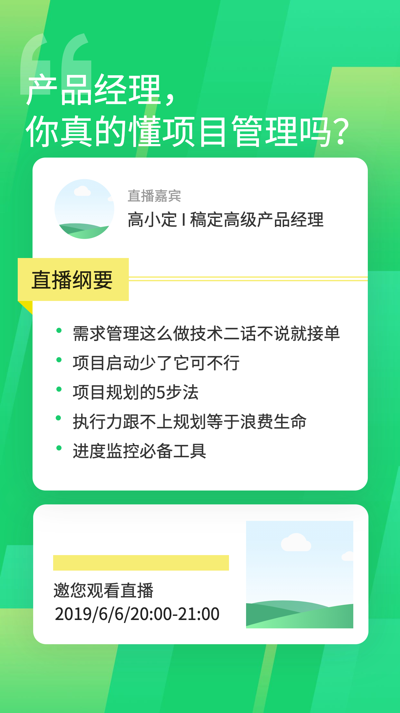

# QR Baker

🚧🚧🚧🚧🚧 Under Contruction 🚧🚧🚧🚧🚧

Add a QR code to your input image in batch with a list of different names and track the clicks of each name.

## Workflow

Input an image (usually a poster for an event or anything) and a list of names to be added onto the image, and get images for each name with different QR codes. The QR codes contains information from the name so that you can track click reference with analysis tools like Google Analytics, Baidu Tongji and so on. The URL of the QR codes are in the form of `http://.../?ref=xian-zhe`, where `xian-zhe` is generated from the Pin Yin of input name.

More detailed information will be updated once this tool is completed.

| Input Image | Output Image |
|---|---|
|  |  |
